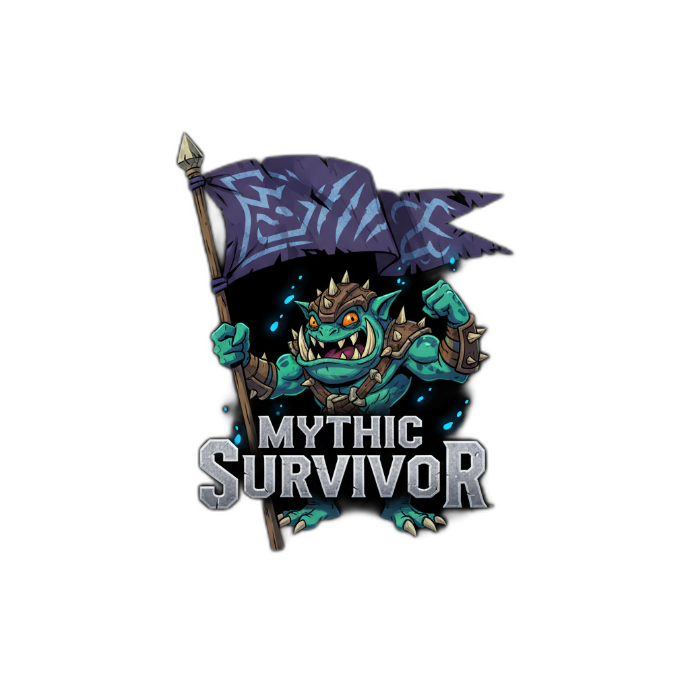

# 🛡️ MythicSurvivor

<div align="center">



**Predict your survival chances in Mythic+ dungeons with precision**

[](https://github.com/muleyo/MythicSurvivor)
[](https://worldofwarcraft.com)
[](LICENSE)

[Features](#-features) • [Installation](#-installation) • [Usage](#-usage) • [Screenshots](#-screenshots) • [Contributing](#-contributing)

</div>

---

## 🎯 What is MythicSurvivor?

MythicSurvivor is a powerful World of Warcraft addon that **predicts whether you'll survive specific boss and trash mob abilities** in Mythic+ dungeons. No more guessing if you need to use a defensive cooldown—get accurate survival predictions based on your current health, gear, and defensive abilities.

### 🔥 Key Highlights
- 📊 **Survival calculations** for Mythic+ abilities
- 📈 **Keystone scaling support** (levels 2-30+)
- ⚡ **Affix integration** (Tyrannical/Fortified)
- 🎨 **Modern, transparent UI**
- 🔧 **Accurate damage formulas** using official WoW APIs

---

## ✨ Features

### 🎯 Survival Prediction
- **Instant calculations** showing if you'll survive specific abilities
- **Overkill damage display** when abilities would be lethal
- **Health remaining** predictions after taking damage
- **Percentage-based survival chances** for quick decision making

### 🛡️ Defensive Management
- **Class-specific personal defensives** (only shows your class abilities)
- **External defensive tracking** (Pain Suppression, Ironbark, etc.)
- **Group buff integration** (Rallying Cry, Devotion Aura, etc.)

---

## 📥 Installation

### Method 1: Manual Installation
1. Download the latest release from [GitHub Releases](../../releases)
2. Extract the `MythicSurvivor` folder to your WoW AddOns directory:
   ```
   World of Warcraft\_retail_\Interface\AddOns\MythicSurvivor\
   ```
3. Restart World of Warcraft or reload your UI (`/reload`)

### Method 2: Curse/CurseForge
1. Install via CurseForge client
2. Search for "MythicSurvivor" in the addon browser
3. Click install and launch WoW

---

## 🚀 Usage

### Opening the GUI
Use the in-game command to open the MythicSurvivor interface:
```
/ms
```

### Basic Workflow
1. **Open MythicSurvivor** with `/ms` command
2. **Set your keystone level** using the slider (2-30+)
3. **Select active defensive abilities** by clicking their icons
4. **View survival predictions** for all abilities in the current content
5. **Plan your defensive usage** based on the predictions

### Understanding the Display
- 🟢 **Green text**: You'll survive with health remaining
- 🔴 **Red text**: Lethal damage - shows overkill amount
- ⚡ **Scaled values**: Damage adjusted for keystone level and affixes

---

## 🖼️ Screenshots

<div align="center">

### Main Interface
*Modern, clean interface showing survival predictions*

### Defensive Selection
*Class-specific defensive abilities with visual selection*

### Keystone Scaling
*Real-time updates based on keystone level and affixes*

</div>

---

## 🛠️ Technical Details

### Damage Calculation
- **Physical damage**: Uses WoW's official armor effectiveness API
- **Magic damage**: Incorporates versatility and magic-specific defensives
- **AOE abilities**: Applies avoidance stat and AOE-specific reductions
- **Keystone scaling**: Official Mythic+ damage multipliers (2-30+)

---

## 📞 Support & Community

### 🔗 Links
- **GitHub**: [MythicSurvivor Repository](https://github.com/muleyo/MythicSurvivor)
- **Issues**: [Bug Reports & Feature Requests](../../issues)

### ❤️ Support the Project
If MythicSurvivor helps you push higher keys:
- ⭐ **Star the repository** to show your support
- 🐛 **Report bugs** to help improve the addon
- 💡 **Suggest features** to make it even better
- 📢 **Share with friends** who run Mythic+ dungeons

---

## 📄 License

This project is licensed under the MIT License - see the [LICENSE](LICENSE) file for details.

---

<div align="center">

**Made with ❤️ for the Mythic+ community**

*Happy key pushing!* 🗝️✨

</div>
